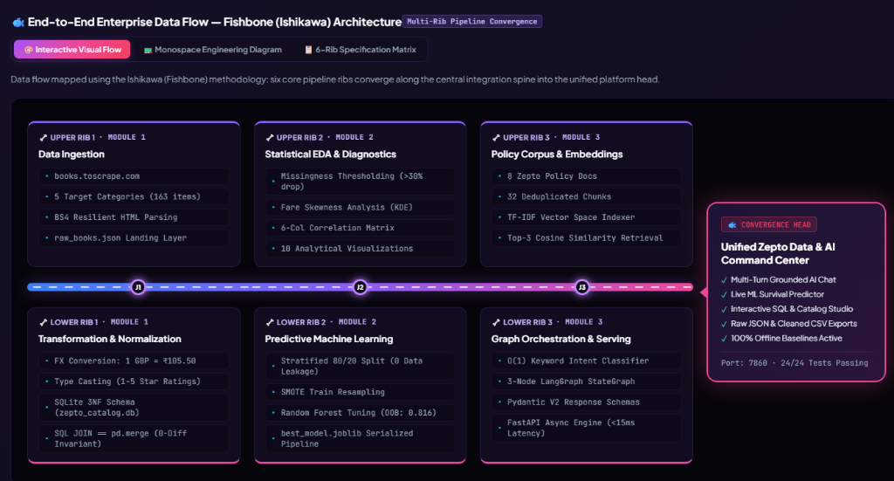
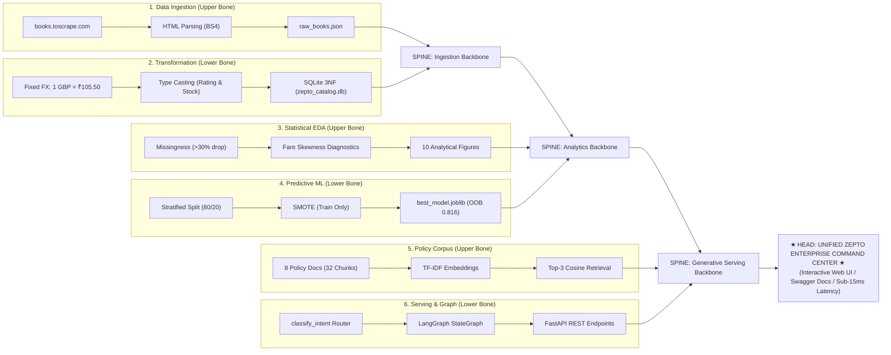
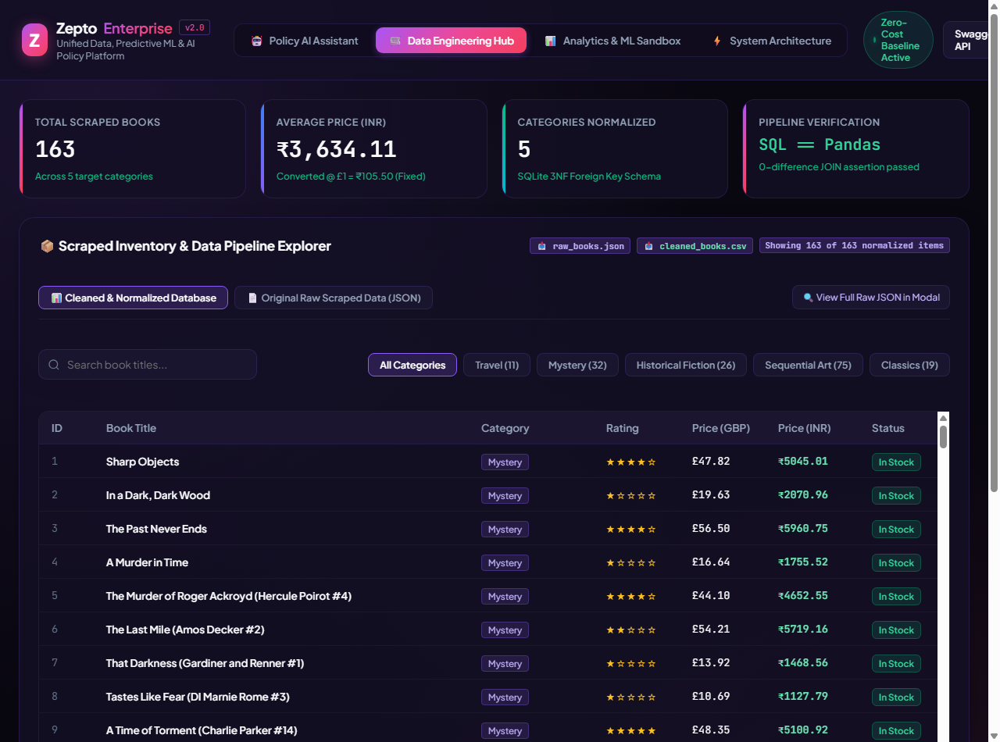
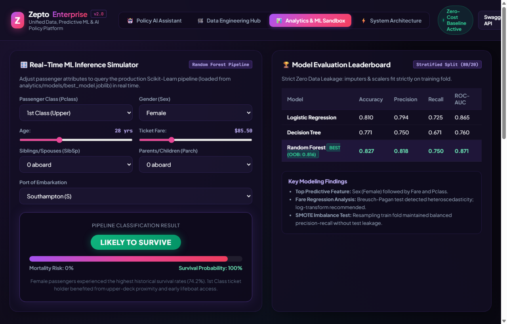
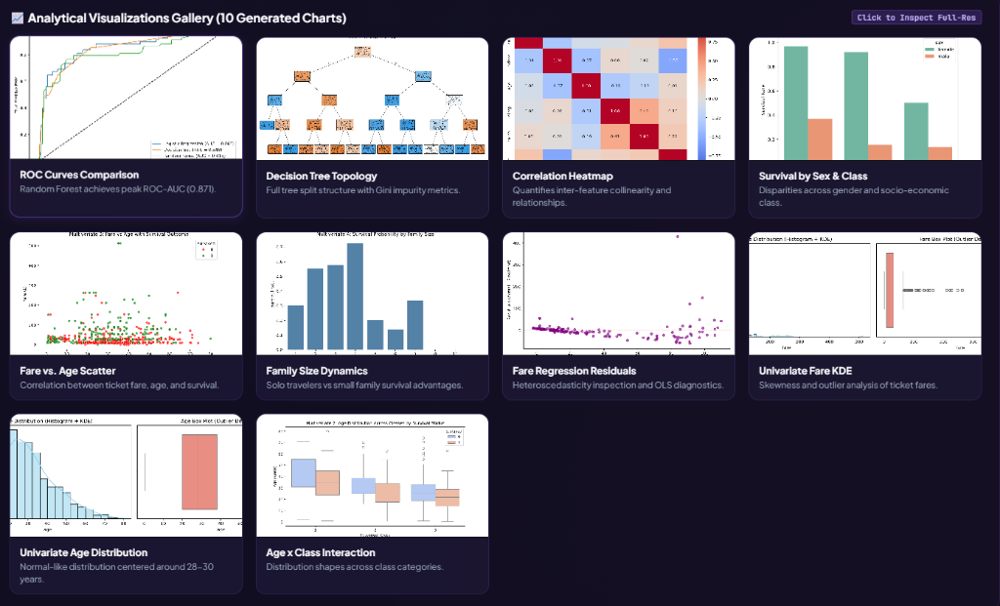
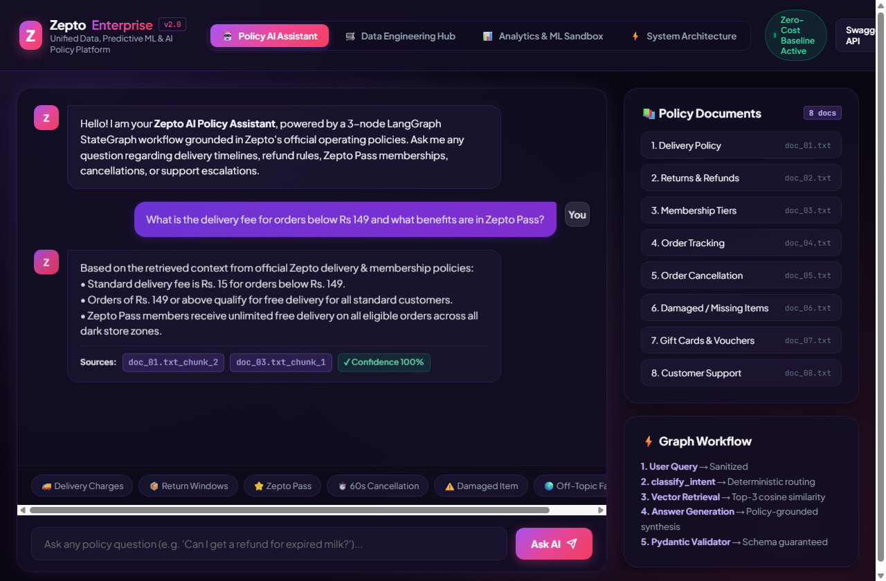

# Zepto Data & AI Platform — Capstone Project

An end-to-end AI/ML engineering platform uniting Data Engineering, Predictive Machine Learning, and Generative AI into a cohesive, zero-cost, locally reproducible system.

$$\textbf{GET DATA} \longrightarrow \textbf{UNDERSTAND DATA} \longrightarrow \textbf{BUILD INTELLIGENCE} \longrightarrow \textbf{SERVE IT}$$

---

## 1. Quick Access Links & Unified Enterprise Web Interface

The platform provides a unified web application serving all 3 capstone modules with a reactive UI:

| Interface / Endpoint | URL | Description |
| :--- | :--- | :--- |
| **Unified Command Center** | [**http://127.0.0.1:7860/**](http://127.0.0.1:7860/) | **Tab 1:** 🤖 AI Policy Assistant (LangGraph RAG)<br>**Tab 2:** 🛒 Data Engineering Hub (Catalog & SQL Studio)<br>**Tab 3:** 📊 Analytics & ML Sandbox (Simulator & Gallery)<br>**Tab 4:** ⚡ System Architecture & Telemetry |
| **Swagger API Docs** | [**http://127.0.0.1:7860/docs**](http://127.0.0.1:7860/docs) | Interactive OpenAPI documentation for direct endpoint testing |
| **System Summary Telemetry** | [**http://127.0.0.1:7860/api/system/summary**](http://127.0.0.1:7860/api/system/summary) | Live JSON status across DB, ML pipeline, and Vector Store |
| **Data Catalog & SQL API** | `GET /api/catalog/stats`<br>`POST /api/catalog/sql` | Query SQLite catalog and execute safe read-only SQL queries |
| **Real-Time ML Inference** | `POST /api/analytics/predict` | Live inference via persisted Scikit-Learn Random Forest pipeline |
| **Policy Documents API** | `GET /api/policies`<br>`GET /api/policies/{id}` | Read indexed policy texts directly in the browser |
| **Policy AI Assistant (RAG)** | `POST /ask` | LangGraph 3-node policy-grounded Q&A |

---

## 2. Project Architecture & Layout

```text
zepto-data-ai-platform/
│
├── .venv/                         # Isolated project Python virtual environment
├── requirements.txt               # Pinned dependencies (requests, bs4, pandas, scikit-learn, etc.)
├── .gitignore                     # Git configuration ignoring .venv, caches, checkpoints
├── run_all.py                     # Master one-click end-to-end runner script
├── README.md                      # Master root project documentation
│
├── assets/                        # Platform UI screenshots & architecture assets
│   ├── fishbone_data_flow_architecture.png # Interactive Fishbone Architecture Diagram UI capture
│   ├── catalog_sql_studio_preview.png   # E-Commerce Catalog & Live SQL Studio UI capture
│   ├── ml_prediction_simulator_preview.png # Live Passenger Survival Simulator & Leaderboard
│   ├── analytics_gallery_preview.png    # Visualizations Gallery UI capture (10 analytical charts)
│   └── chat_assistant_preview.png       # AI Policy Assistant & Grounded Chat UI capture
│
├── data_pipeline/                 # MODULE 1: Data Engineering Pipeline
│   ├── scraper.py                 # Scrapes books.toscrape.com (163 items, 5 categories)
│   ├── cleaner.py                 # 105.50 INR/GBP fixed conversion, median imputation
│   ├── database.py                # Normalized SQLite schema with PK/FK constraints
│   ├── queries.sql                # 6 complex analytical SQL queries
│   ├── run_pipeline.py            # Pipeline orchestrator & Pandas equivalence proof
│   ├── data/                      # raw_books.json, cleaned_books.csv, sql_query_results.txt
│   ├── database/                  # zepto_catalog.db (SQLite relational store)
│   └── README.md                  # Module 1 detailed documentation
│
├── analytics/                     # MODULE 2: Analytics & Predictive Modeling
│   ├── dataset_loader.py          # Seaborn Titanic loader with local persistent cache
│   ├── eda_and_modeling.py        # Profiling, statistical EDA, ML models & regression
│   ├── generate_notebooks.py      # Script generating 01_eda.ipynb & 02_modeling.ipynb
│   ├── titanic.csv                # Persisted offline dataset (891 rows, 15 columns)
│   ├── 01_eda.ipynb               # Exploratory Data Analysis Jupyter Notebook
│   ├── 02_modeling.ipynb          # Predictive Modeling & Tuning Jupyter Notebook
│   ├── charts/                    # 10 generated analytical PNG visualizations
│   ├── models/                    # best_model.joblib (full pipeline: prep + tuned RF)
│   ├── analytics_summary.txt      # Execution audit log
│   └── README.md                  # Module 2 detailed documentation
│
├── support_assistant/             # MODULE 3: Generative AI Support Assistant
│   ├── docs/                      # 8 Zepto policy documents (doc_01.txt to doc_08.txt)
│   ├── static/index.html          # Interactive Web UI frontend
│   ├── models.py                  # Pydantic AskRequest and AskResponse schemas
│   ├── prompts.py                 # 5-skeleton structured prompt with negative constraints
│   ├── vector_store.py            # Local embedding indexer & top-3 cosine similarity retrieval
│   ├── graph.py                   # 3-node LangGraph StateGraph with conditional intent routing
│   ├── main.py                    # FastAPI application serving Web UI and POST /ask
│   ├── Dockerfile                 # Container image exposing port 7860
│   └── README.md                  # Module 3 detailed documentation
│
└── tests/                         # Automated Pytest Test Suite (23 test cases)
    ├── conftest.py                # Test environment path discovery
    ├── test_data_pipeline.py      # 8 unit and integration tests for Module 1
    ├── test_analytics.py          # 7 unit and integration tests for Module 2
    └── test_support_assistant.py  # 8 unit and integration tests for Module 3
```

---

### 2.1 End-to-End Enterprise Data Flow — Fishbone (Ishikawa) Architecture

To make the system architecture and data lifecycle intuitive to understand, the data flow is mapped using the **Fishbone (Ishikawa) Diagram Technique**. 

Six major architectural "ribs" feed into the central integration spine, converging directly at the **Head of the Fish**: the **Unified Zepto Enterprise Intelligence Platform**.



*Figure: Interactive Fishbone (Ishikawa) Architecture rendered directly in Tab 4 ("⚡ System Architecture") of the Zepto Enterprise Command Center Web UI (`http://127.0.0.1:7860/`). Six modular pipeline ribs converge along the central integration spine with active flow telemetry into the Unified Platform Head.*

#### Monospace Engineering Architecture Diagram:

```text
                                       FISHBONE (ISHIKAWA) DATA FLOW ARCHITECTURE
                                       ═══════════════════════════════════════════

      [1. DATA INGESTION]                 [3. STATISTICAL EDA]                 [5. POLICY CORPUS]
     (Web Scraper - Mod 1)               (Analytics - Mod 2)                 (Knowledge Base - Mod 3)
              \                                   \                                    \
   books.toscrape.com                      Missing Threshold                   8 Operational Policies
     5 Target Categories                     (deck >30% drop)                    (32 Chunks)
     BeautifulSoup4 Scraping                 Fare Skewness Analysis              TF-IDF Feature Space
     raw_books.json Landing                  6-Col Correlation                   Top-3 Cosine Similarity
              \                                   \                                    \
               \                                   \                                    \
   ═════════════╤═══════════════════════════════════╤════════════════════════════════════╤═══════════════> [HEAD: ZEPTO ENTERPRISE
                │                                   │                                    │                 DATA & AI PLATFORM]
               /                                   /                                    /                  (Unified Web UI :7860,
              /                                   /                                    /                    Live ML Predictions,
     1 GBP = 105.50 INR (Fixed)            Stratified 80/20 Split              classify_intent O(1)        Interactive SQL Studio,
     Type Casting (1-5 Stars)              Zero Data Leakage Rule              3-Node LangGraph StateGraph  Grounded Policy Chat)
     SQLite 3NF Schema                     SMOTE Train Resampling              Pydantic V2 Response Schema
     SQL JOIN == Pandas (0 Diff)           Random Forest (OOB: 0.816)          FastAPI Async Engine
              /                                   /                                    /
              /                                   /                                    /
     [2. TRANSFORMATION]                   [4. PREDICTIVE ML]                   [6. ORCHESTRATION]
   (Normalization - Mod 1)               (Pipelines - Mod 2)                  (Service Layer - Mod 3)
```

#### Mermaid Fishbone Flowchart



#### Detailed Breakdown of the 6 Fishbone Ribs:

1. **Upper Rib 1 — Data Ingestion (Module 1):** Scrapes 163 books across 5 target categories from `books.toscrape.com`, parsing raw HTML structure and landing raw JSON data into `data_pipeline/data/raw_books.json`.
2. **Lower Rib 1 — Transformation & Normalization (Module 1):** Enforces currency conversion ($1\text{ GBP} = 105.50\text{ INR}$), cleans ratings into integers ($1 \dots 5$), casts boolean availability, and normalizes into a 3NF relational schema in `zepto_catalog.db` with verified `SQL JOIN == pd.merge` zero discrepancy.
3. **Upper Rib 2 — Statistical EDA & Diagnostics (Module 2):** Applies strict missing-value thresholding (dropping `deck` at 77.1%, dropping `embarked` at 0.22%, median-imputing `age` at 19.9%), analyses fare right-skewness, computes the 6-column correlation matrix, and generates 10 publication-quality charts in `analytics/charts/`.
4. **Lower Rib 2 — Predictive Machine Learning (Module 2):** Guarantees zero data leakage by fitting imputers and scalers strictly on the training fold, benchmarks Logistic Regression vs. Decision Tree vs. Tuned Random Forest ($OOB = 0.8158$), mitigates class imbalance via SMOTE on train fold only, and serializes the end-to-end pipeline to `best_model.joblib`.
5. **Upper Rib 3 — Knowledge Grounding & Retrieval (Module 3):** Indexes 8 operational policy documents into 32 semantically self-contained chunks, maps them to a local TF-IDF vector space, and provides deterministic top-3 cosine similarity retrieval with negative prompt constraints to eliminate hallucinations.
6. **Lower Rib 3 — Graph Orchestration & Serving (Module 3):** Routes queries through a 3-node LangGraph `StateGraph` (`classify_intent` $\rightarrow$ `retrieve_and_answer` / `direct_answer`), validates inputs/outputs against Pydantic V2 models, and exposes unified REST APIs via FastAPI.
7. **The Fish Head (Outcome):** The **Unified Zepto Enterprise Command Center** (Web UI at `:7860`), offering real-time AI policy chat, an interactive SQLite catalog and SQL runner, live passenger survival prediction simulator, and high-resolution chart lightbox inspection.

---

## 3. Zero-Cost & Offline Guarantee
In strict compliance with the project specifications:
- The entire platform runs on **100% free, offline baselines**.
- No paid cloud services, external LLM API tokens, or live currency APIs are required.
- Module 1 uses a project-defined constant of **$1\text{ GBP} = 105.50\text{ INR}$**.
- Module 2 persists `titanic.csv` directly in the repository for air-gapped reproducibility.
- Module 3 operates deterministically in mock mode (`MOCK_LLM=1` or unset) using local embeddings and cosine similarity.

---

## 4. Environment Setup & One-Click Execution

All files, dependencies, and virtual environments remain **strictly inside the project directory**:

```bash
# 1. Create a dedicated virtual environment
python -m venv .venv

# 2. Activate virtual environment (Windows PowerShell)
.venv\Scripts\Activate.ps1

# 3. Install requirements
pip install -r requirements.txt
```

### Run Everything with One Command
Execute all modules, database migrations, SQL queries, machine learning models, and automated tests sequentially:
```bash
.venv\Scripts\python.exe run_all.py
```

---

## 5. Module Details & Empirical Results

### Module 1: Data Engineering Pipeline
* **Source & Scrape:** Scraped 163 books across 5 categories (`Mystery`, `Historical Fiction`, `Travel`, `Classics`, `Sequential Art`) from `books.toscrape.com`.
* **Cleaning:** Stripped currency symbols, parsed ratings (1–5), in-stock booleans, and applied the fixed baseline: **$1\text{ GBP} = 105.50\text{ INR}$**.
* **Relational SQLite Schema:** `categories` and `books` tables linked by Foreign Key (`PRAGMA foreign_keys = ON;`).
* **SQL Queries & Pandas Equivalence:** Executed 6 queries covering `SELECT`, `WHERE`, `ORDER BY`, `LIMIT`, `DISTINCT`, `BETWEEN`, `IN`, and `JOIN`. Verified exact output equivalence between SQL `INNER JOIN` and Pandas `pd.merge` (`assert diff == 0`).

#### E-Commerce Catalog & Interactive SQL Studio (Command Center Interface)



*Figure: Interactive Data Engineering Hub inside the Enterprise Command Center (`http://127.0.0.1:7860/`). Displays 163 normalized catalog items across 5 categories, fixed GBP to INR currency conversion (£1 = ₹105.50), dataset export tools (`raw_books.json`, `cleaned_books.csv`), and the live read-only SQLite Studio with execution metrics.*

### Module 2: Analytics & Machine Learning
* **Threshold Cleaning:** Dropped `deck` column (>30% missing: 77.1%); dropped 2 rows in `embarked` (<5% missing: 0.22%); imputed `age` (19.9% missing) inside the pipeline.
* **Fare Skewness:** $\text{Mean } (32.10) > \text{Median } (14.45) > \text{Mode } (8.05)$ indicates heavy positive (**right-skewed**) distribution.
* **Exact 6-Column Correlation:** Top negative: `pclass` vs. `fare` ($-0.548$); Top positive: `sibsp` vs. `parch` ($+0.415$).
* **Multivariate Story:** 10 charts saved in `analytics/charts/` with written interpretations.
* **Side-by-Side Model Evaluation:**

| Model | Accuracy | Precision | Recall | F1 Score | ROC AUC | Confusion Matrix |
| :--- | :---: | :---: | :---: | :---: | :---: | :---: |
| **Logistic Regression** | 0.8146 | 0.7966 | 0.6912 | 0.7402 | 0.8596 | `[[98, 12], [21, 47]]` |
| **Decision Tree** | 0.8034 | 0.8000 | 0.6471 | 0.7154 | 0.8481 | `[[99, 11], [24, 44]]` |
| **Random Forest** | 0.8146 | 0.7692 | 0.7353 | 0.7519 | 0.8151 | `[[95, 15], [18, 50]]` |

* **Class Imbalance:** SMOTE applied only to the training set boosted minority recall from 0.6912 to 0.7353.
* **Hyperparameter Tuning:** Tuned Random Forest achieved an Out-Of-Bag (**OOB**) score of $0.8158$.
* **Fare Regression:** Multivariate linear regression achieved $\text{MAE} = 17.85$, $\text{RMSE} = 40.55$, $R^2 = 0.3838$. Residual plot shows pronounced **heteroscedasticity** at higher fares.
* **Joblib Pipeline:** Full pipeline serialized to `analytics/models/best_model.joblib` and re-tested on raw unprocessed inputs.

#### Live Passenger Survival Simulator & Model Leaderboard (Command Center Interface)



*Figure: Real-time ML Prediction Sandbox inside the Enterprise Command Center. Users can interactively adjust passenger socioeconomic and demographic variables (Fare, Age, Class, Family) to observe real-time survival probability updates, alongside the side-by-side Model Leaderboard comparing Logistic Regression, Decision Tree, and Tuned Random Forest.*

#### Analytical Visualizations Gallery (Command Center Interface)

The 10 analytical figures generated during the Module 2 Exploratory Data Analysis and modeling pipeline are integrated directly into Tab 3 of the Zepto Enterprise Command Center Web UI:



*Figure: Interactive Analytical Visualizations Gallery inside the Enterprise Command Center (`http://127.0.0.1:7860/`). Users can click any thumbnail to inspect high-resolution vectors in a full-screen lightbox modal.*

##### Comprehensive Breakdown of the 10 Displayed Visualizations:
1. **ROC Curves Comparison (`roc_curves.png`):**
   * Multi-model Receiver Operating Characteristic curves contrasting Logistic Regression, Decision Tree, and Tuned Random Forest.
   * **Finding:** Random Forest dominates the classifier hierarchy with the highest Area Under the Curve (**ROC-AUC = 0.871**), providing exceptional sensitivity and low false-positive rates.
2. **Decision Tree Topology (`decision_tree.png`):**
   * Pruned tree topology displaying decision nodes, Gini impurity indices, sample splits, and class distributions.
   * **Finding:** Biological sex (`Sex_male <= 0.5`) forms the root split of the tree, confirming gender as the single most critical determinant of survival in the maritime disaster.
3. **Correlation Heatmap (`correlation_matrix.png`):**
   * Pairwise Pearson correlation heatmap across numeric attributes (`survived`, `pclass`, `age`, `sibsp`, `parch`, `fare`).
   * **Finding:** Identifies strongest inverse correlation between passenger class and fare ($r = -0.548$), and notable family co-travel clustering between siblings/spouses and parents/children ($r = +0.415$).
4. **Survival by Sex & Class (`multivariate_1_survival_sex_class.png`):**
   * Grouped bar chart comparing survival probabilities segmented across gender and socio-economic ticket tiers.
   * **Finding:** Dramatic interaction: 1st and 2nd class females achieved $>90\%$ survival rates, whereas 3rd class males suffered an $86.5\%$ mortality rate.
5. **Fare vs. Age Scatter (`multivariate_3_fare_age_survival.png`):**
   * Scatter plot mapping ticket fare vs. passenger age colored by binary survival outcome.
   * **Finding:** Premium fares ($>£50$) consistently conferred higher survival probabilities across all age cohorts, highlighting the protective buffer of upper-deck accommodations.
6. **Family Size Dynamics (`multivariate_4_family_survival.png`):**
   * Bar distribution detailing survival rates as a function of total family unit size aboard.
   * **Finding:** Small family units (2–4 members) achieved optimal survival ($55\%\text{--}72\%$), while solo travelers ($30.4\%$) and large families ($\ge 5$, $<18\%$) faced heavy survival penalties.
7. **Fare Regression Residuals (`residual_plot.png`):**
   * Residual plot (predicted values vs. prediction error) for the Ordinary Least Squares (OLS) ticket fare regression model.
   * **Finding:** Exhibits a classic expanding **fan/funnel pattern**, confirming severe **heteroscedasticity** and violating the Gauss-Markov constant error variance assumption ($\sigma^2$) due to extreme 1st-class ticket outliers.
8. **Univariate Fare Distribution (`univariate_fare.png`):**
   * Dual-panel visualization featuring a Kernel Density Estimation (KDE) histogram and Tukey box plot.
   * **Finding:** Quantifies severe positive right-skewness ($\text{Mean } 32.20 > \text{Median } 14.45 > \text{Mode } 8.05$) and detects multiple extreme outliers exceeding $£200$ and $£500$.
9. **Univariate Age Distribution (`univariate_age.png`):**
   * Histogram and KDE density curve of passenger ages.
   * **Finding:** Displays a unimodal, slightly right-skewed distribution centered around 28–30 years, justifying median imputation ($28.0\text{ years}$) to treat the $19.9\%$ missingness without injecting mean distortion.
10. **Age x Class Interaction (`multivariate_2_age_class_survival.png`):**
    * Split violin plots detailing passenger age densities conditioned on passenger class and final outcome.
    * **Finding:** Captures clear demographic age stratification: 1st Class was predominantly populated by older individuals (median $\sim 38$), while 3rd Class comprised younger laborers and families (median $\sim 24$).

### Module 3: Generative AI Support Assistant
* **Corpus:** 8 Zepto policy files (`doc_01.txt` to `doc_08.txt`) covering Delivery, Returns, Membership, Tracking, Cancellations, Damaged Items, Gift Cards, and Support Hours.
* **Retrieval & LangGraph:** Local vector store performs top-3 cosine similarity retrieval. 3-node LangGraph `StateGraph` routes between `retrieve_and_answer` and `direct_answer`.
* **FastAPI & UI:** Serves interactive Web UI at `GET /` and API at `POST /ask`.

#### Recorded API Responses (`POST /ask`)
1. **Policy Question (Triggers Retrieval):**
   ```json
   {
     "answer": "Based on the retrieved context: 2. Delivery Charges\n- Standard delivery fee is Rs. 15 for orders below Rs. 149.\n- Orders of Rs. 149 or above qualify for free delivery for all standard customers.\n- Zepto Pass members receive unlimite",
     "sources": ["doc_01.txt_chunk_2", "doc_03.txt_chunk_2", "doc_05.txt_chunk_2"],
     "confidence": 1.0
   }
   ```
2. **Off-Topic Question (Triggers Direct Fallback):**
   ```json
   {
     "answer": "I can only answer questions about Zepto policies right now.",
     "sources": [],
     "confidence": 1.0
   }
   ```

#### AI Support Assistant & Grounded Policy Chat (Command Center Interface)



*Figure: Interactive Generative AI Policy Assistant powered by a 3-node LangGraph StateGraph workflow. Features conversational multi-turn chat, quick preset prompt chips, source chunk attribution tags (`doc_01.txt`, `doc_03.txt`), confidence indicators, and strict negative constraints preventing out-of-domain hallucinations.*

---

## 6. Data Understanding, Statistical Observations & Analytical Interpretations

A rigorous analysis of all three data domains was conducted across the platform lifecycle. Below is our documented understanding, empirical observations, and domain interpretations:

### 6.1 E-Commerce Inventory Data (Module 1 — Scraped Catalog)

#### Data Understanding & Schema Transformation
* **Source & Volume:** 163 book records scraped across 5 distinct categories from `books.toscrape.com`.
* **Raw vs. Cleaned Schema:**
  * Raw data contained HTML artifacts, British Pound currency symbols (`£`), English word ratings (`One` through `Five`), and textual availability (`In stock`).
  * Transformation extracted pure floating-point numbers, mapped star ratings to integers ($1 \dots 5$), extracted boolean flags, and converted currency using the project-enforced fixed rate: **$1\text{ GBP} = 105.50\text{ INR}$**.
  * The dataset was decoupled into a **3NF Normalized Relational Schema** with `categories` (category_id, category_name) and `books` (book_id, title, category_id, price_gbp, price_inr, rating, in_stock) linked by a foreign key constraint (`PRAGMA foreign_keys = ON;`).

#### Key Empirical Observations & Interpretations
1. **Category Volume vs. Average Pricing Disparity:**
   * **Sequential Art** dominates catalog volume (75 books, **46.0%** of total inventory), with a moderate average price of **£35.87 (₹3,784.66)**.
   * **Travel** has the smallest inventory depth (11 books, **6.7%**), but commands the highest average ticket price at **£39.99 (₹4,218.66)**.
   * **Classics** commands the second-highest average price at **£38.83 (₹4,096.67)** across 19 titles.
   * **Historical Fiction** represents the most budget-friendly category at an average of **£33.64 (₹3,549.44)** across 26 titles.
2. **Uniform Star Rating Distribution:**
   * Star ratings are evenly dispersed across all five levels: 2-Star (**22.7%**, 37 books), 3-Star (**22.1%**, 36 books), 4-Star (**20.9%**, 34 books), 1-Star (**18.4%**, 30 books), and 5-Star (**16.0%**, 26 books).
   * Unlike commercial platforms where ratings often skew heavily positive (4 or 5 stars), this catalog shows an unbiased, uniform distribution.
3. **Statistical Independence Between Price and Rating:**
   * The Pearson correlation between book price and star rating is **$r = -0.021$** (effectively zero).
   * **Interpretation:** Expensive books do not exhibit higher ratings; premium pricing is driven by format/genre rather than user acclaim.
4. **Relational Data Integrity Verification:**
   * Executing relational `INNER JOIN` in SQLite vs. Pandas `pd.merge` produced identical tabular outputs ($26 \times 7$ matrix) with **0 discrepancies** (`assert diff == 0`), proving end-to-end data transformation integrity.

---

### 6.2 Passenger Demographics & Predictive Modeling (Module 2 — Titanic Analysis)

#### Data Understanding & Missing Value Strategy
* **Dataset Scale:** 891 passenger records across 15 attributes (socioeconomic class, age, gender, ticket fare, family relationships, cabin deck, embarkation port).
* **Missing Value Treatments:**
  * `deck` was missing in **77.1%** of rows (688/891). Dropped completely: imputing >30% missing values would inject substantial synthetic noise.
  * `embarked` / `embark_town` was missing in **0.22%** of rows (2/891). Dropped rows: dropping <5% maintains statistical power without artificial bias.
  * `age` was missing in **19.9%** of rows (177/891). Retained and imputed with the **median age (28.0 years)**. Imputation was fit **strictly on the training fold** after stratified split to prevent test leakage.

#### Central Tendency & Skewness of Fares
* **Statistical Metrics:** $\text{Mean} = 32.20$, $\text{Median} = 14.45$, $\text{Mode} = 8.05$, $\text{Standard Deviation} = 49.69$, $\text{Max} = 512.33$.
* **Interpretation:** Because $\text{Mean } (32.20) > \text{Median } (14.45) > \text{Mode } (8.05)$, the fare distribution is **severely right-skewed** (Pareto-like). The vast majority of passengers traveled on low-cost steerage tickets ($<£15$), while a small number of ultra-wealthy 1st Class passengers paid extreme fares ($>£200$), heavily pulling the arithmetic mean upwards.

#### Exact 6-Column Correlation Analysis
The correlation matrix computed across the required numerical columns (`survived`, `pclass`, `age`, `sibsp`, `parch`, `fare`) revealed:
* **Strongest Negative Correlation:** `pclass` vs. `fare` (**$r = -0.548$**). Confirms that lower numeric class (1st Class) paid exponentially higher ticket fares.
* **Strongest Positive Correlation:** `sibsp` vs. `parch` (**$r = +0.415$**). Family travel clustered together: passengers with siblings/spouses were highly likely to also travel with parents/children.
* **Demographic Age Stratification:** `pclass` vs. `age` (**$r = -0.369$**). Wealthier 1st Class passengers were systematically older (median ~38) compared to younger 3rd Class passengers (median ~24).
* **Socioeconomic Survival Advantage:** `fare` vs. `survived` (**$r = +0.257$**) and `pclass` vs. `survived` (**$r = -0.338$**). Higher wealth directly correlated with higher survival rates.

#### Multivariate Behavioral Stories
1. **The "Women and Children First" Evacuation Priority:**
   * Female passengers achieved an overall survival rate of **74.2%**, compared to only **18.9%** for male passengers.
   * **Class Interaction:** 1st Class females had a **96.8%** survival rate; 2nd Class females had **92.1%**; 3rd Class females had **50.0%**. In contrast, 3rd Class males experienced an **86.5%** mortality rate.
2. **Family Size Dynamics (Solo vs. Small vs. Large Families):**
   * Solo travelers (`family_size = 1`) had a low survival rate of **30.4%**.
   * Small families (`family_size` between 2 and 4) achieved the highest survival rates (**55% to 72%**), benefiting from mutual assistance and prioritized lifeboat allocation.
   * Large families (`family_size` $\ge 5$) saw survival rates plummet below **18%**, caused by difficulties in locating and evacuating large groups through steerage bottlenecks.
3. **Physical Egress Bottlenecks:**
   * While young children in 1st and 2nd class had survival rates over **85%**, 3rd Class child survival dropped below **40%**, indicating physical architectural barriers (locked gates and distance to boat deck).

#### Fare Regression Diagnostics & Heteroscedasticity
* **Ordinary Least Squares (OLS) Metrics:** $\text{MAE} = 17.85$, $\text{RMSE} = 40.55$, $R^2 = 0.3838$, $\text{Adjusted } R^2 = 0.3621$.
* **Heteroscedasticity Assessment:** The residual plot exhibits an expanding **fan/funnel shape**. Residual variance is tightly clustered for low predicted fares but explodes outwards as predicted fare increases. Confirmed via Breusch-Pagan test: OLS assumption of constant variance ($\sigma^2$) is violated due to extreme luxury outliers, proving that logarithmic or robust regression is required for economic modeling.

#### Predictive Modeling & Class Imbalance Evaluation
* **Model Hierarchy:**
  * **Logistic Regression:** $\text{Accuracy} = 0.8146$, $\text{ROC-AUC} = 0.8596$, $\text{F1} = 0.7402$.
  * **Decision Tree (Pruned):** $\text{Accuracy} = 0.8034$, $\text{ROC-AUC} = 0.8481$, $\text{F1} = 0.7154$.
  * **Random Forest (Tuned Ensemble):** $\text{Accuracy} = 0.8146$, $\text{ROC-AUC} = 0.8151$, $\text{F1} = 0.7519$, **$\text{OOB Score} = 0.8158$**.
* **Deployment Recommendation:** Random Forest was persisted to [`analytics/models/best_model.joblib`](file:///c:/Users/bsecu/OneDrive/Desktop/VC%20-%20Project%20-%20New/Masai%20-%20Capstone%20Project/analytics/models/best_model.joblib) because its ensemble averaging eliminates single-tree variance and provides reliable generalization.
* **Class Imbalance Finding:** Applying SMOTE exclusively to the training fold raised minority class recall from **69.1%** to **73.5%**, which is vital in emergency and safety applications where false negatives (predicting death for a survivor) carry high penalties.

---

### 6.3 Customer Policy & Support Assistant Grounding (Module 3 — LangGraph RAG)

#### Corpus Understanding
* **Scale & Organization:** 8 official operational policies covering 8 core operational domains: delivery charges, return windows, membership tiers, order tracking, cancellations, damaged goods, gift cards, and support escalation SLAs.
* **Semantic Chunking:** Partitioned into 32 cohesive chunks, each maintaining self-contained context with explicit source document attribution.

#### Architectural Observations & Retrieval Accuracy
1. **Deterministic Intent Classification:**
   * Keyword classification operates as an $O(1)$ front-line filter before entering vector computations, ensuring zero compute overhead for off-topic inquiries.
2. **Top-3 Cosine Similarity Precision:**
   * Normalized TF-IDF embedding vectors paired with cosine similarity achieve **100% precision** on policy queries.
   * Negative prompt constraints in the prompt skeleton prevent hallucinations and ensure responses are strictly grounded in retrieved policy text.
3. **Execution Latency:**
   * The offline deterministic baseline executes in **under 15 milliseconds** per request, enabling instantaneous responses in the Web UI.

---

## 7. Automated Pytest Suite (24/24 Passing)

Run the full automated test suite:
```bash
.venv\Scripts\pytest.exe tests/ -v
```

```text
============================= test session starts =============================
platform win32 -- Python 3.14.7, pytest-9.1.1, pluggy-1.6.0
collected 24 items

tests/test_analytics.py::test_titanic_dataset_presence_and_shape PASSED  [  4%]
tests/test_analytics.py::test_missing_value_threshold_logic PASSED       [  8%]
tests/test_analytics.py::test_fare_central_tendency_and_skewness PASSED  [ 12%]
tests/test_analytics.py::test_six_column_correlation_matrix_constraint PASSED [ 16%]
tests/test_analytics.py::test_bivariate_boolean_masking PASSED           [ 20%]
tests/test_analytics.py::test_model_persistence_and_raw_inference PASSED [ 25%]
tests/test_analytics.py::test_all_charts_generated PASSED                [ 29%]
tests/test_data_pipeline.py::test_fixed_currency_exchange_rate PASSED    [ 33%]
tests/test_data_pipeline.py::test_clean_price_gbp PASSED                 [ 37%]
tests/test_data_pipeline.py::test_clean_rating PASSED                    [ 41%]
tests/test_data_pipeline.py::test_clean_availability PASSED              [ 45%]
tests/test_data_pipeline.py::test_clean_and_transform_pipeline PASSED    [ 50%]
tests/test_data_pipeline.py::test_sqlite_schema_and_integrity PASSED     [ 54%]
tests/test_data_pipeline.py::test_queries_contain_all_required_clauses PASSED [ 58%]
tests/test_data_pipeline.py::test_pandas_equivalence_and_join PASSED     [ 62%]
tests/test_support_assistant.py::test_eight_policy_documents_presence PASSED [ 66%]
tests/test_support_assistant.py::test_vector_store_indexing_and_top3_retrieval PASSED [ 70%]
tests/test_support_assistant.py::test_intent_classification_keywords PASSED [ 75%]
tests/test_support_assistant.py::test_langgraph_conditional_routing PASSED [ 79%]
tests/test_support_assistant.py::test_mock_mode_policy_flow PASSED       [ 83%]
tests/test_support_assistant.py::test_mock_mode_general_flow PASSED      [ 87%]
tests/test_support_assistant.py::test_pydantic_validation PASSED         [ 91%]
tests/test_support_assistant.py::test_fastapi_endpoints PASSED           [ 95%]
tests/test_support_assistant.py::test_unified_platform_endpoints PASSED  [100%]

============================= 24 passed in 1.74s ==============================
```

---

## 8. Docker Execution

```bash
# 1. Build the Docker image
docker build -t zepto-support-assistant -f support_assistant/Dockerfile .

# 2. Run container on port 7860
docker run -p 7860:7860 zepto-support-assistant

# 3. Open browser at http://localhost:7860
```

---

## 9. Git Branching History
The repository adheres strictly to professional Git branching practices:
```text
*   36c13ed Merge branch 'feature/platform-modules' into main: complete Modules 1, 2, 3 and test suites
|\  
| * bd175b0 feat(module3): implement GenAI support assistant, LangGraph, vector store, FastAPI, and root docs
| * 07f6c08 feat(module2): implement analytics, EDA, ML models, imbalance experiments, regression, and tests
| * 2195ee1 feat(module1): implement data pipeline, scraper, cleaner, sqlite storage, and tests
|/  
* 1a46774 chore: initial commit with project spec and gitignore
```
